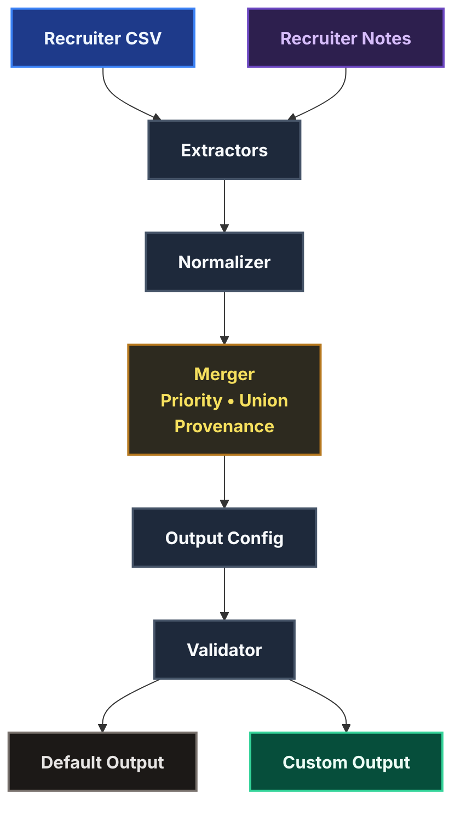
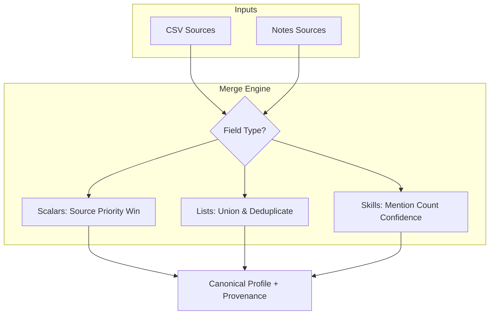
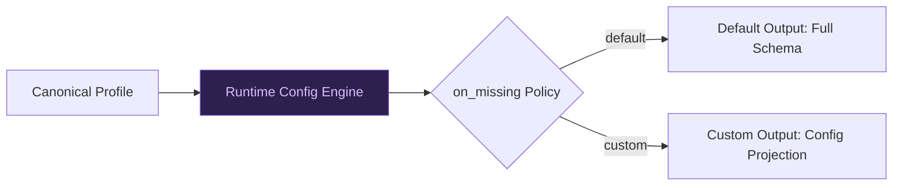

# Multi-Source Candidate Data Transformer — Technical Design
**Sakshi Singh · Eightfold AI Assignment**

---

## 1. Problem Statement
Candidate data arrives from structured and unstructured sources with conflicting values. The system produces a single canonical profile using deterministic normalization, conflict resolution, provenance tracking, and configurable output.

---

## 2. System Architecture
The end-to-end flow from input source ingestion down to schema-validated JSON:

---

## 3. Merge Strategy & Confidence
Conflicting fields are merged deterministically using fixed priority rules, and overall confidence is computed based on profile completeness:

- **Scalar Fields**: Higher-priority source wins.
- **List Fields**: Union + Deduplicate.
- **Skills**: confidence = sources mentioning skill / total sources.
- **Overall Confidence**: populated key fields / total key fields.

---

## 4. Runtime Configuration & Projection
A runtime JSON configuration reshapes the output layout dynamically without requiring codebase changes:

- **Default Config**: Emits all canonical fields, including complete provenance and confidence metrics.
- **Custom Config**: Evaluates path expressions (e.g., `emails[0]`, `skills[].name`), selects specific fields, renames keys, and toggles metadata.

---

## 5. Normalization Strategy & Canonical Schema

### Formats
- **Phone**: E.164 (e.g. `+919876543210`) via `phonenumbers`.
- **Dates**: YYYY-MM (e.g. `2025-06`) via `python-dateutil`.
- **Country**: ISO-3166 alpha-2 (e.g. `IN`) via lookup.
- **Skills**: Lowercased canonical synonyms (e.g. `js` &rarr; `javascript`).

### Key Schema Fields
- `candidate_id` (UUID4)
- `full_name`
- `emails`
- `phones`
- `location` (city, region, country)
- `links` (linkedin, github, portfolio, other)
- `headline`
- `years_experience`
- `skills` (name, confidence, sources)
- `experience` (company, title, start, end, summary)
- `education` (institution, degree, field, end_year)
- `provenance` (field, source, method)
- `overall_confidence`

---

## 6. Edge Cases

- **Missing / Malformed Source**: Extractor captures exceptions safely and surfaces a warning without crashing.
- **Conflicting Values**: Deterministic source priority ensures the most reliable values win.
- **Partial Records**: Sources automatically complement one another to fill missing fields.
- **Skill Synonyms**: Synonyms mapped to canonical forms prior to merging.

---

## 7. Scope Decisions & Future Work

### Implemented (Current Scope)
- **Recruiter CSV**: Structured source ingestion.
- **Recruiter Notes**: Unstructured source block-extraction.
- **Data normalization**: Standardized formats for phones, dates, countries, and skills.
- **Conflict resolution**: Priority-based merging tracking provenance.
- **Confidence scoring**: Scoring profile completeness and skill frequency.
- **Runtime configurable output**: Target field mapping and schema projection.
- **Schema validation**: Dynamic output schema generation and validation.
- **Graceful degradation**: Individual source failures do not terminate the pipeline; valid sources continue to be processed.

### Future Work
- **ATS JSON extractor**: Integration of additional structured candidate payloads.
- **Resume PDF/DOCX parser**: Text mining from uploaded documents.
- **LinkedIn / GitHub profile extractors**: Automated data fetching via public APIs.
- **Configurable source priority**: Externalizing the source trust order to the config.
- **Fuzzy candidate matching**: Phonetic or edit-distance clustering for name variations.
- **Stable candidate IDs**: Generating repeatable candidate hashes instead of random UUIDs.

These enhancements were intentionally left out to keep the implementation focused on the assignment requirements while maintaining a clean, modular, and explainable design.

